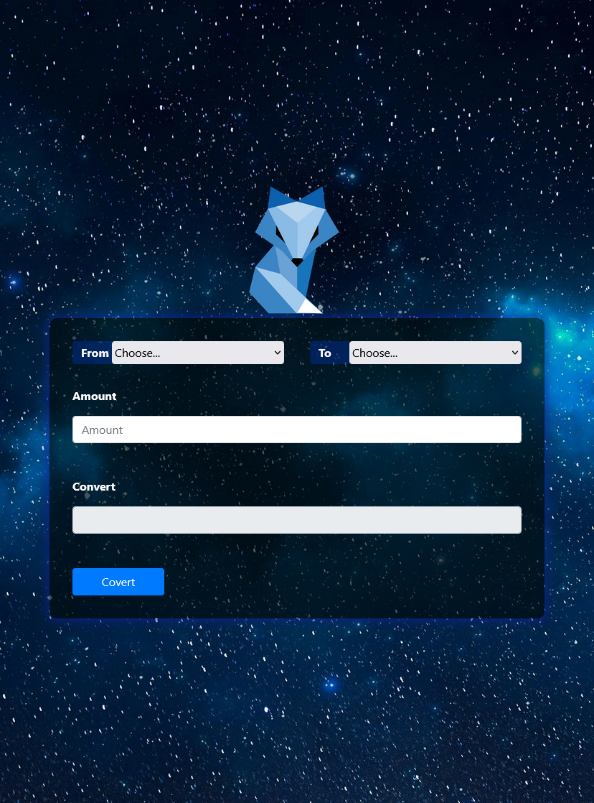

# Currency converter

# Project – Currency converter

This is a solution to a challenge at the DCI (Digital Career Institute). The challenges help you improve your programming skills by creating realistic projects. This task was about creating a currency converter using the Coinbase API.

## Table of contents

- [Overview](#Overview)
  - [Screenshot](#screenshot)
  - [Left](#left)
- [My Process](#my-process)
  - [Built with](#built-with)
  - [What I learned](#what-i-learned)
  - [Continued Development](#continued-development)
- [Author](#Author)

## Overview

### Screenshot

### Left

- Solution URL: [Github Solutions](https://github.com/Adem-Tozlu/Project-Crypto-Currencyconverter)
- Live Site URL: [Website Crypto-Currency Converter](https://project-crypto-currencyconverter.vercel.app/)

## My process

### Built with

- Semantic HTML5 markup
- Custom CSS properties
- Mobile-first workflow
- Bootstrap
- Javascript

### What I have learned

During the course of this project, I was able to significantly expand my skills in the following areas:

    CSS: Through intensive engagement with the design possibilities of CSS, I have considerably deepened my knowledge and skills in this area.

    Javascript: The active application of Javascript in the project has given me valuable experience in dealing with this programming language.

    APIs: By integrating APIs into the project, I have gained practical knowledge in using interfaces for data transmission and processing.

    DOM: Working with the DOM (Document Object Model) has improved my understanding of the structure and functionality of HTML-based web pages.

In summary, it can be said that this project has made an important contribution to my professional development.

### Further development

In the future, I plan to improve my CSS and Javascript skills. My goal is to create more complex websites and design them better.

## Author

- Website - [Github](https://github.com/Adem-Tozlu)
- Frontend Mentor – [@Adem-Tozlu](https://www.frontendmentor.io/profile/Adem-Tozlu)
- Linkedin - [@Adem-Tozlu](https://www.linkedin.com/in/adem-tozlu-8906b52a5)